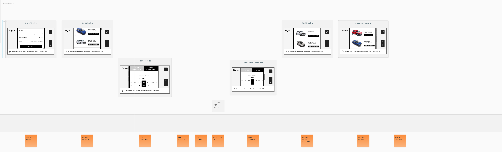
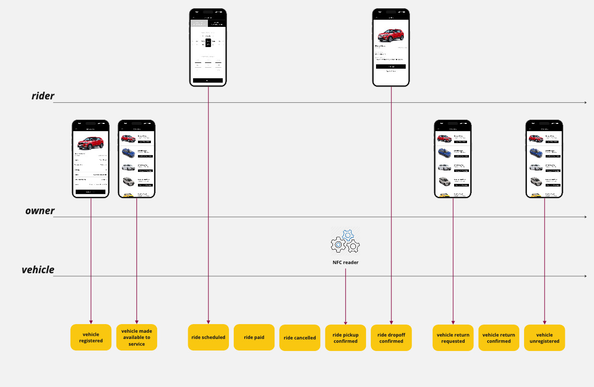

# Exercise 2, Step 1

### [link to module](   https://www.youtube.com/embed/Gx-ZjZiNiWs?si=WZZ8sCOiuMXUAo45?&start=20&end=196)
                                                                                        
 

We now have a storyboard of our system, i.e., the sequence of 
business domain events with interfaces depicting key moments of the
user experience:
 

[evidentdesign.com import](event-model.json)

instructor's solution

student's solution
 

The goal of this step is to add in the commands that will empower our
users to change the system.  Commands are represented by blue stickies
that are placed in the timeline lane between the interface where the
user invokes the Command and its resulting Event.  These commands are
named as verb phrases in the imperative, e.g. "Request Ride" or "Add
Vehicle."  Commands are the only way that the system can be changed, 
so they are the only way that the system can be tested. 
