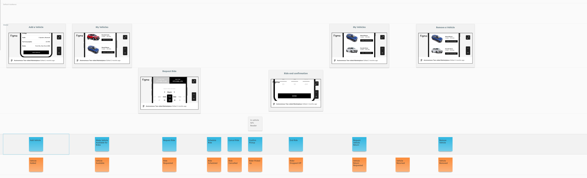

# Exercise 2, Step 2

### [link to module](https://www.youtube.com/embed/Gx-ZjZiNiWs?si=WZZ8sCOiuMXUAo45?&start=307&end=497)

 

We have the commands to enable users to change the system: 

[evidentdesign.com import](event-model.json)

instructor's solution

student's solution
 

To know what changes to make, we'll need to inform users of the 
current state of the system via read models.

Read Models are represented by green sticky notes that are placed 
within the timeline lane.  They are named views of the current state 
of domain entities such as "Ride" or "My Vehicle."  
