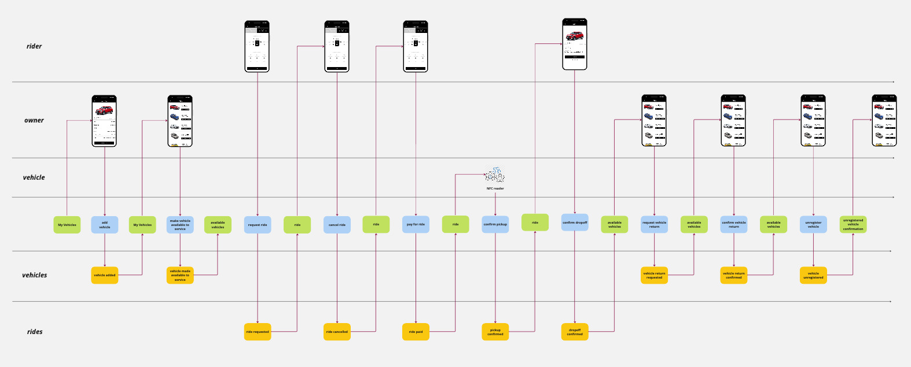

# Exercise 2, Step 4 (Solution)

### [link to module (independent business value streams and bounded contexts)](https://www.youtube.com/embed/vX08Qt5xHsY?si=ibBy5SDK2B9RNAak?&start=145&end=249)

 

[evidentdesign.com import](event-model.json)

instructor's solution

student's solution
 

